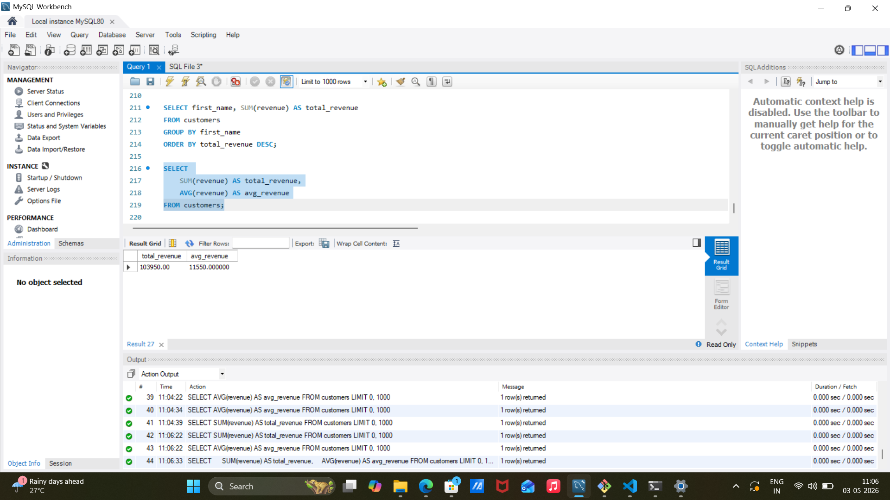

# Customer Data Pipeline

## Overview
This project demonstrates an end-to-end data pipeline built using Python, Pandas, and MySQL. The pipeline reads raw data from a CSV file, transforms it, and loads it into a structured database.

## Problem
Raw CSV data is not directly usable for analysis. It needs cleaning, structuring, and proper storage.

## Approach
ETL process:
- Extract: Read CSV using Pandas  
- Transform: Clean data and adjust revenue  
- Load: Insert into MySQL  

## Tech Stack
- Python  
- Pandas  
- MySQL  
- SQL  
- Git  

## Project Structure

project1/
│── extract.py
│── transform.py
│── load.py
│── main.py
│── sales.csv
│── sql_analysis.png
│── sql_output.png
│── README.md


## SQL Analysis

### 1. Top Customers by Revenue

```sql
SELECT first_name, SUM(revenue) AS total_revenue
FROM customers
GROUP BY first_name
ORDER BY total_revenue DESC;
```

#### Output


---

### 2. Overall Revenue Metrics

```sql
SELECT 
    SUM(revenue) AS total_revenue,
    AVG(revenue) AS avg_revenue
FROM customers;
```

#### Output



---