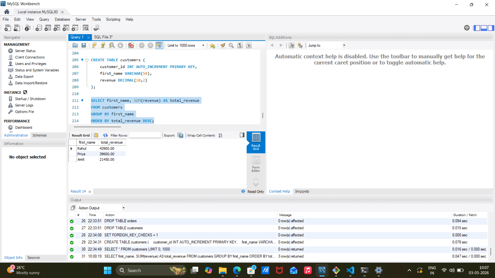

# Customer Data Pipeline

## Overview

This project demonstrates an end-to-end data pipeline built using Python, Pandas, and MySQL. The pipeline reads raw data from a CSV file, performs basic transformations, and loads the processed data into a structured database.

## Problem

Raw data stored in flat files is not always ready for analysis. It often requires cleaning, formatting, and structuring before it can be used effectively. This project addresses that by building a simple pipeline to process and store data in a database.

## Approach

The pipeline follows a standard ETL (Extract, Transform, Load) process:

* Extract: Read data from a CSV file using Pandas
* Transform: Apply basic data cleaning and revenue adjustment
* Load: Insert the processed data into a MySQL database

## SQL Analysis

The following query was used to analyze customer revenue:

SELECT first_name, SUM(revenue) AS total_revenue
FROM customers
GROUP BY first_name
ORDER BY total_revenue DESC;

This analysis identifies top-performing customers based on total revenue, enabling better business decision-making.

### Output

## Tech Stack

* Python
* Pandas
* MySQL
* SQL
* Git

## Implementation Details

### Data Extraction

The dataset is read from a CSV file using Pandas and stored as a DataFrame.

### Data Transformation

Revenue values are adjusted and the dataset is cleaned to ensure consistency before loading.

### Data Loading

A connection is established with MySQL using `mysql-connector-python`, and the processed records are inserted into the database.

## Project Structure

project1/
│── main.py
│── sales.csv
│── README.md

## Outcome

* Built a working ETL pipeline using Python and MySQL
* Gained hands-on experience with data ingestion, transformation, and storage
* Understood how structured databases improve data usability

## Next Steps

* Add error handling and logging
* Automate the pipeline using scheduling tools
* Extend to handle larger datasets
