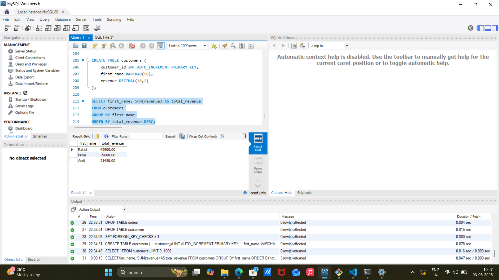
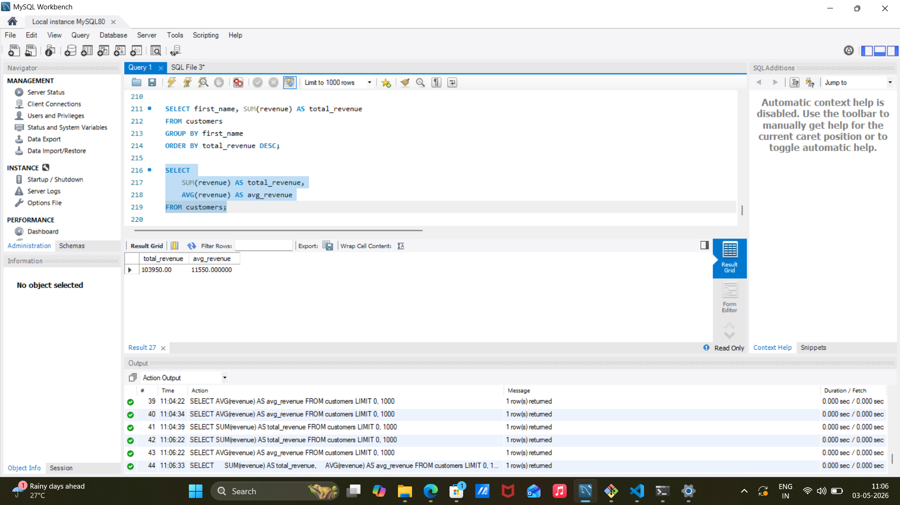
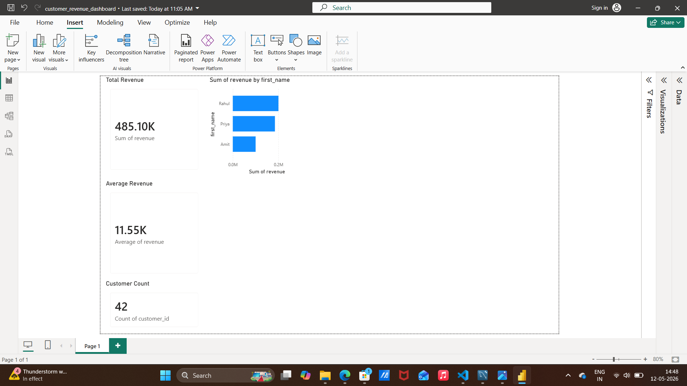

# Customer Data Pipeline

## Overview
This project demonstrates an end-to-end data pipeline built using Python, Pandas, and MySQL. The pipeline reads raw data from a CSV file, transforms it, and loads it into a structured database.

## Problem
Raw CSV data is not directly usable for analysis. It needs cleaning, structuring, and proper storage.

## Approach
ETL process:
- Extract: Read CSV using Pandas  
- Transform: Clean data and adjust revenue  
- Load: Insert into MySQL  

## Tech Stack
- Python  
- Pandas  
- MySQL  
- SQL  
- Git  

## Project Structure

project1/
│── extract.py
│── transform.py
│── load.py
│── main.py
│── sales.csv
│── sql_analysis.png
│── sql_output.png
│── README.md


## SQL Analysis

### 1. Top Customers by Revenue

```sql
SELECT first_name, SUM(revenue) AS total_revenue
FROM customers
GROUP BY first_name
ORDER BY total_revenue DESC;
```

#### Output



---

### 2. Overall Revenue Metrics

```sql
SELECT 
    SUM(revenue) AS total_revenue,
    AVG(revenue) AS avg_revenue
FROM customers;
```

#### Output



---

### Data Validation
Added validation checks to ensure data quality before loading into MySQL:
- Empty file check
- Missing customer name check
- Missing revenue check
- Negative revenue check


## Power BI Dashboard

The dashboard below visualizes key business metrics including total revenue, average revenue, customer count, and top customers by revenue.



# Azure Data Factory ETL Pipeline

This project demonstrates a cloud-based ETL pipeline using Azure services.

## Architecture

- Azure Blob Storage
- Azure Data Factory
- Azure SQL Database

## Workflow

1. Upload CSV to Blob Storage
2. Create Linked Services
3. Create Datasets
4. Build Copy Data Pipeline
5. Load data into Azure SQL
6. Validate data using SQL queries

---

## Screenshots

### Blob Storage Container


### Linked Services


### Datasets


### Pipeline Success


### SQL Table Data


### SQL Count Validation
